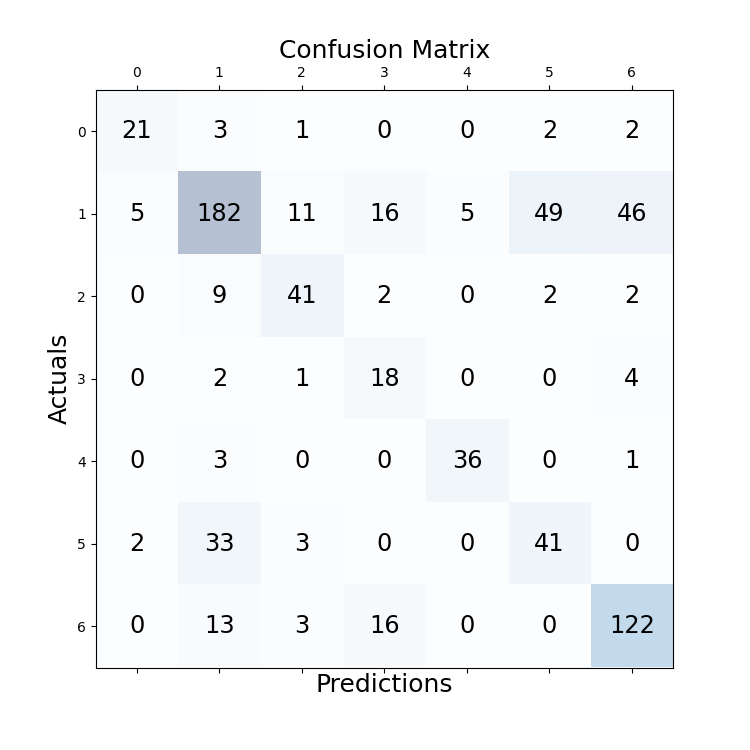

# experiment details
file: BERT-BiLSTM-CRF

## configuration
```
cfg['batch_size'] = 4
cfg['epoch'] = 30
cfg['lr'] = 1e-3
cfg['seq_len'] = 658
cfg['padding_threshold'] = 300
cfg['dropout_rate'] = 0.5 (between crf, lstm)
```
model: Legal-BERT  
optimizer: AdamW  
scheduler: CosineAnnealingLR  

valid best: 0.591

## testing result

Document 01 acc: 0.8621  
Document 02 acc: 0.7969  
Document 03 acc: 0.7347  
Document 04 acc: 0.6222  
Document 05 acc: 0.4750  
Document 06 acc: 0.6145  
Document 07 acc: 0.5882  
Document 08 acc: 0.4937  
Document 09 acc: 0.7041  
Document 10 acc: 0.6903  
Average acc over documents: 0.6582  
Average acc of all sentences:  0.6614  
 