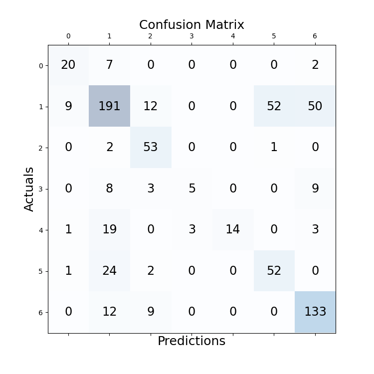

# experiment details
file: BERT-BiLSTM-CRF

## configuration
```
cfg['batch_size'] = 4  
cfg['epoch'] = 30  
cfg['lr'] = 1e-3  
cfg['seq_len'] = 658  
cfg['padding_threshold'] = 300  
cfg['dropout_rate'] = 0.5 (between crf, lstm)  
```
model: Legal-BERT fine-tuned with same prediction task  
optimizer: Ranger21  
scheduler: CosineAnnealingLR  

valid best: 0.66  

## testing result

Document 01 acc: 0.7414  
Document 02 acc: 0.7812  
Document 03 acc: 0.6531  
Document 04 acc: 0.7111  
Document 05 acc: 0.4500  
Document 06 acc: 0.6265  
Document 07 acc: 0.6029  
Document 08 acc: 0.6329  
Document 09 acc: 0.7551  
Document 10 acc: 0.6726  
Average acc over documents: 0.6627  
 