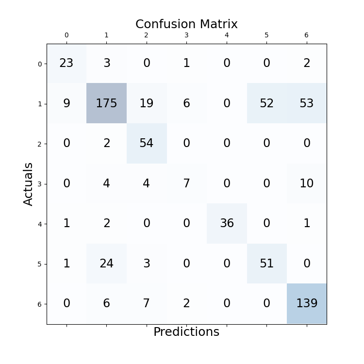

# experiment details
file: BERT-BiLSTM-CRF

## configuration
```
cfg['batch_size'] = 16  
cfg['epoch'] = 20  
cfg['lr'] = 1e-5  
cfg['seq_len'] = 658  
cfg['padding_threshold'] = 0  
cfg['dropout_rate'] = 0.5 (between crf, lstm)  
```
model: Legal-BERT fine-tuned with same prediction task  
optimizer: Ranger21  
scheduler: CosineAnnealingLR  

valid best: 0.739, epoch: 6  

## testing result

Document 01 acc: 0.6897  
Document 02 acc: 0.8281  
Document 03 acc: 0.6939  
Document 04 acc: 0.8000  
Document 05 acc: 0.4000  
Document 06 acc: 0.6386  
Document 07 acc: 0.6176  
Document 08 acc: 0.6709  
Document 09 acc: 0.7551  
Document 10 acc: 0.7434  
Average acc over documents: 0.6837  
Average acc of all sentences: 0.6958  
 