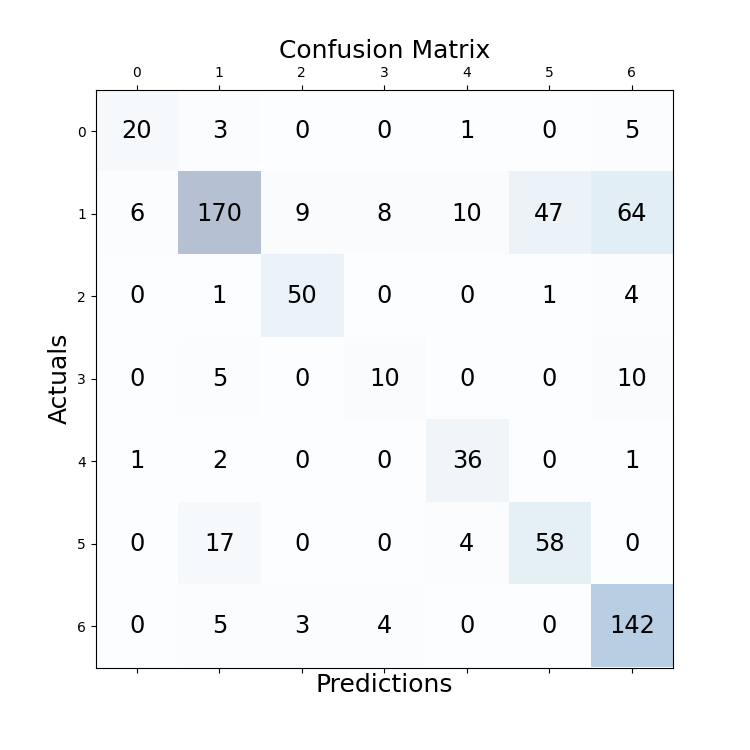

# experiment details
file: BERT_CLSlike

## configuration
```
cfg['batch_size'] = 4  
cfg['epoch'] = 7  
cfg['lr'] = 1e-5  
cfg['seq_len'] = 5  
```
model: Legal-BERT  
optimizer: AdamW  
scheduler: CosineAnnealingLR  

best valid acc: 0.6728971962616822, epoch: 0  

## testing result

Document 01 acc: 0.7069  
Document 02 acc: 0.8281  
Document 03 acc: 0.6327  
Document 04 acc: 0.7778  
Document 05 acc: 0.5750  
Document 06 acc: 0.7108  
Document 07 acc: 0.6765  
Document 08 acc: 0.6329  
Document 09 acc: 0.6735  
Document 10 acc: 0.7257  
Average acc over documents: 0.6940  
Average acc of all sentences: 0.6973  
 