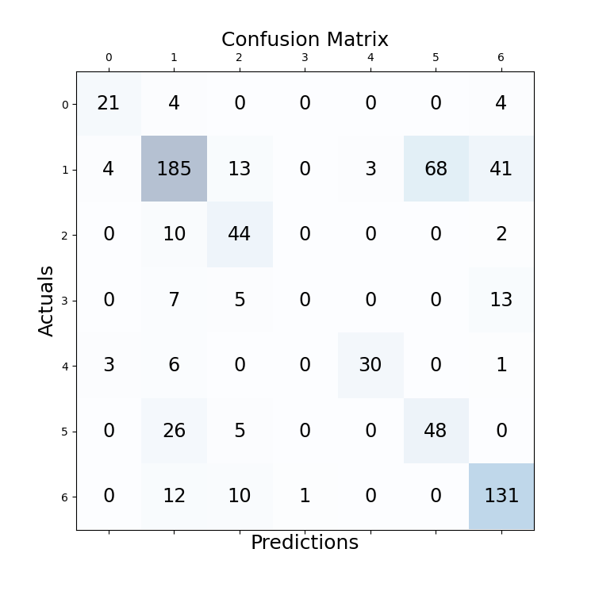

# experiment details
file: BERT_NERlike

## configuration
```
cfg['batch_size'] = 4  
cfg['epoch'] = 7  
cfg['lr'] = 1e-5  
cfg['seq_len'] = 5  
```
model: Legal-BERT  
optimizer: AdamW  
scheduler: CosineAnnealingLR  

best valid acc: 0.659708559513092, epoch: 3  

## testing result

Document 01 acc: 0.6724  
Document 02 acc: 0.7812  
Document 03 acc: 0.7347  
Document 04 acc: 0.6667  
Document 05 acc: 0.4000  
Document 06 acc: 0.7831  
Document 07 acc: 0.5588  
Document 08 acc: 0.5696  
Document 09 acc: 0.6429  
Document 10 acc: 0.6814  
Average acc over documents: 0.6491  
Average acc of all sentences:  0.658  

 