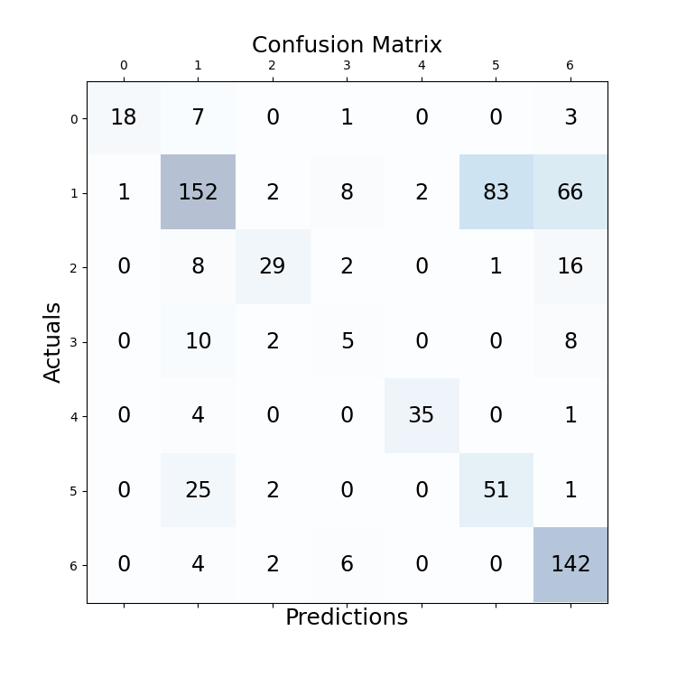

# experiment details
file: BERT-BiLSTM-CRF

## configuration
```
cfg['batch_size'] = 16  
cfg['epoch'] = 20  
cfg['lr'] = 1e-5  
cfg['seq_len'] = 658  
cfg['padding_threshold'] = 0  
cfg['dropout_rate'] = 0.5 (between crf, lstm)  
```
model: Legal-BERT freezed
optimizer: Ranger21  
scheduler: CosineAnnealingLR  

best valid acc: 0.623781681060791, epoch: 14  

## testing result

Document 01 acc: 0.6724  
Document 02 acc: 0.7969  
Document 03 acc: 0.7347  
Document 04 acc: 0.6889  
Document 05 acc: 0.4250  
Document 06 acc: 0.5422  
Document 07 acc: 0.5588  
Document 08 acc: 0.4684  
Document 09 acc: 0.6224  
Document 10 acc: 0.6814  
Average acc over documents: 0.6191  
Average acc of all sentences:  0.6198  

   