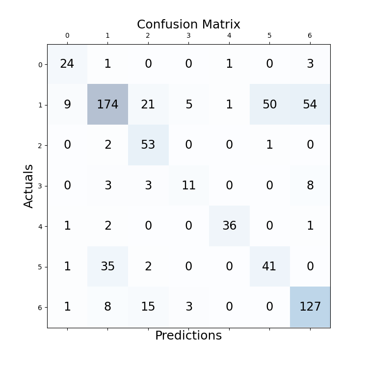

# experiment details
file: BERT-BiLSTM-CRF

fix idx2emb mapping relation  
## configuration
```
cfg['batch_size'] = 16  
cfg['epoch'] = 20  
cfg['lr'] = 1e-5  
cfg['seq_len'] = 658  
cfg['padding_threshold'] = 0  
cfg['dropout_rate'] = 0.5 (between crf, lstm)  
```
model: Legal-BERT fine-tuned with same prediction task  
optimizer: Ranger21  
scheduler: CosineAnnealingLR  

best valid acc: 0.6931774020195007, epoch: 13  

## testing result

Document 01 acc: 0.6724  
Document 02 acc: 0.7656  
Document 03 acc: 0.6735  
Document 04 acc: 0.7556  
Document 05 acc: 0.4750  
Document 06 acc: 0.7349  
Document 07 acc: 0.5441  
Document 08 acc: 0.6582  
Document 09 acc: 0.7347  
Document 10 acc: 0.6195  
Average acc over documents: 0.6634  
Average acc of all sentences:  0.6686  
   